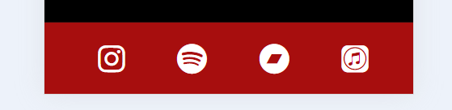
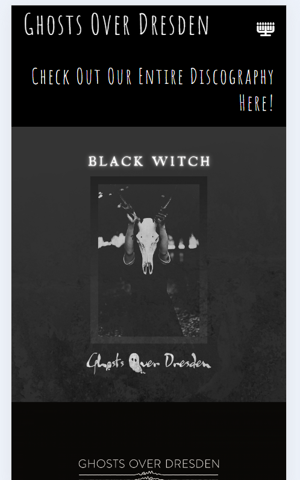
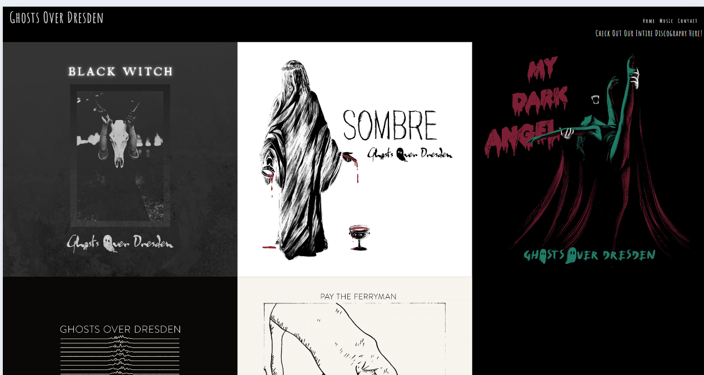
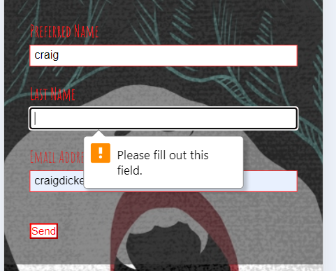
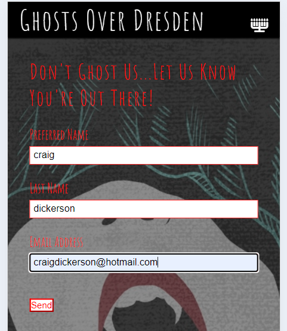
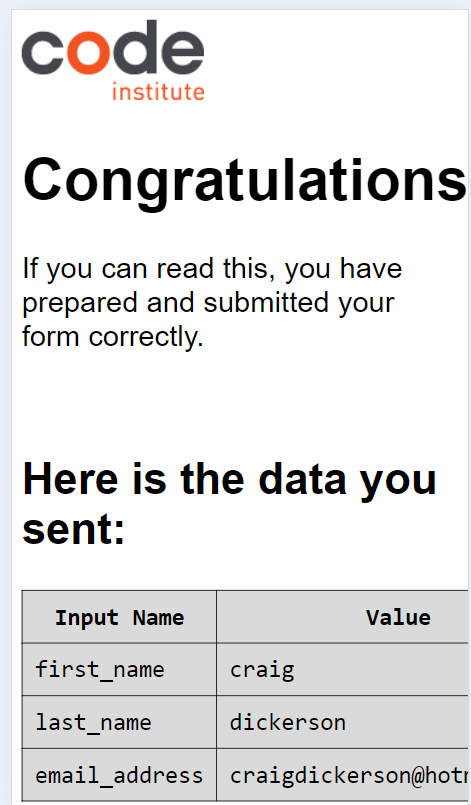

# [GHOSTS OVER DRESDEN](https://craigdickerson725.github.io/ghosts_over_dresden)

Welcome to the Ghosts Over Dresden Band Website!  The goal of this website is to serve as a site to both introduce the band to those unfamiliar with their music, and also to provide those who are already fans an outlet for listening to the entire discography and sign up for the mailing list.

The wish of the band was to use all original images (taken by band members and friends of the band alike) to draw the interest of those who are checking out the band for the first time.  Because the music appeals to the darkwave/post-punk genres, the style is purposely dark with a goth asthetic. 

source: [amiresponsive](https://ui.dev/amiresponsive?url=https://craigdickerson725.github.io/ghosts_over_dresden)

## UX

I began the design with a mobile-first approach in mind. I started with the homepage, using the Code Institute's 'Love Running' walkthrough project as a basis for getting the ball rolling.  However, since this is a website for a musical project, it was important to incorporate the music into the website.  For that reason, I chose to add a 'Music' page rather than a 'Gallery' page, as well as creating links so that clicking on the artwork takes the user to the YouTube page for the release clicked.

Of course, a band needs to keep a good relationship with their listeners, and be accessible to them.  For this reason, a Contact page was added with a signup form, so that the user can be notified anytime a new track, merch item, or live show date is released.  As most bands are currently making their announcements via social media platforms, the band and I did not find it necessary to expand the website, as they create the bulk of their multi-media content exclusively for their social media sites--which are linked in the footer of the webpage.

### Colour Scheme

Ghosts Over Dresden are a part of the 'goth' scene, so the color scheme was quite simple:  dark colors, with a black backgroud when applicable, and typically red or white text.  The photos/artwork was all created by professional artists who are a part of the band, and the colors they kept are typically dark, with mysterious images that appeal to fans of the gothic asthetic as well as the musical subcultures that are part of the goth scene.

- `rgb (0, 0, 0)` used for backgrounds when applicable.
- `rgb (255, 255, 255)` used for all home and music page text.
- `rgb (255, 0, 0)` used for contact form text.

### Typography

In considering fonts, it was important for the band to have something that looked both 'hand-written' as well as dark but elegant at the same time.  In reviewing many different fonts on Google Fonts, it was decided that the Amatic SC font was the best choice.  Therefore, [Amatic-SC](https://fonts.googleapis.com/css2?family=Amatic+SC:wght@400;700&display=swap) was used for all headers and titles.

## User Stories

### New Site Users

- As a new site user, I would like to see a cool, catchy graphic, so that I can get a feel for the vibe of the band.
- As a new site user, I would like to see a short bio, so that I can understand where the band comes from and what their goal is.
- As a new site user, I would like to have a discography page that links to the band's releases, so that I can hear the music they are making.
- As a new site user, I would like to have a contact page, so that I can connect with the band and receive news concerning the band as it happens.

### Returning Site Users

- As a returning site user, I would like to easily find the complete discography, so that I can listen to the music that I have not yet heard.
- As a returning site user, I would like to easily find a way to contact the band, so that I can request live shows, merch, or anything that I feel should be made available to fans.
- As a returning site user, I would like to have quick access to the various social media pages for the band, as well as streaming platforms, so that I can see what the band is up to more immediately (ie, daily social posts, etc).

## Features

### Existing Features

- **Interactive Navigation Bar**

    - The Navigation Bar is set up to the upper right of the screen (opposite the header, which is set up on the right side) on large screens. There is a toggle option to show an underline beneath the page being highlighted by the mouse.

    

    -For mobile screens, the navbar is represented in the upper right corner of the screen by a candelabra when not activated.  When activated, the navigation menu drops down underneath the header.

    
    

- **Footer which provides quick links to the most popular social media pages, as well as most popular streaming platforms**

    - The footer appears at the bottom of each page and contains links to the most relevant and important social media/streaming platform pages of the band.  The links are interactive, and display the icons for Instagram, Spotify, Band Camp, and iMusic.  Clicking on the icons takes the user to the appropriate page.  For many users, this will be the most important feature of the page, as most fans in this time desire constant social media posts from bands to feel connected to them.

- **Music Page With Complete Discography which Connects to Each Release**

    - The music page is simple, but effective.  It displays the cover art for each of the band's releases.  Touching (for mobile screens) or clicking (for laptops/desktops) the artwork takes the user to the Youtube site for the release, so the user can hear the music.  

-**Contact Page With Email Signup**

  - The contact page provides a signup form, so that the user can connect with the band.  All fields are required, so the information should be filled out completely or a message will inform the user to complete the info.  Also, a confirmation is given when the information is correctly submitted.

### Future Features

- ADD A NEWS PAGE FOR UPCOMING PROJECTS
    - The band are working on a full-length album, as well as booking gigs and creating merchandise.  When these things are ready, they wish to add a new page for News, which would be providing info on all the merch, upcoming music releases, and live shows.
- JUKEBOX ADDED TO MUSIC PAGE
    - When more music becomes available, it would be a nifty addition to have a 'jukebox' style player added to the music page.  This would contain every available song, all in one convenient place, available at one click.
- OPEN FORUM WHERE FANS CAN CHAT WITH THE BAND AND EACH OTHER
    - As the following for the band grows, it would be a great feature to provide a space for the fans to leave messages to the band, and for the band to respond.  Also, fans from different geographical locations could also connect and form new friendships.