# Testing

> [!NOTE]  
> Return back to the [README.md](README.md) file.

## Feature-by-Feature Testing:

### Navigation 

The Navbar was the first feature tested. In the mobile design, it was important that it did not take up to much space, but rather just the right hand corner of the screen next to the header.  It is represented by a candelabra, which when touched opens a dropdown menu that provides quick and easy access to each page.

On large screens, the navbar is fully displayed with the names of each page.  The page names are responsive, and toggle to show which page is highlighted by the cursor.

The navbar is responsive and working as expected (with quick transitions between pages and links properly directed to the target page.  This was tested in Chrome, Edge, and Firefox.

### Footer

The footer is designed simply to provide quick access to the most desired social media and streaming platform pages for the band.  The icons all link to the proper pages, and do so in Chrome, Edge, and Firefox.

### Music

The Music page allows the user to see the complete discography for the band.  Each release is represented by its corresponding artwork.  Clicking the artwork directs the user to the YouTube page for listening.  Each link works correctly and is properly labeled, and the images are all properly marked with alt text for screenreaders.  This has been tested in Chrome, Edge, and Firefox.

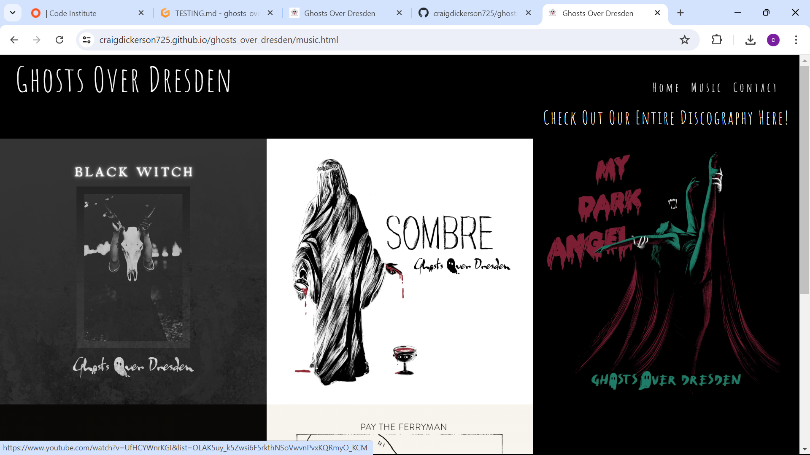
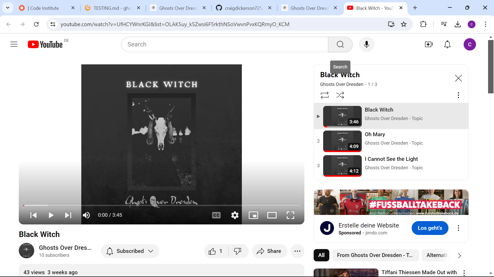
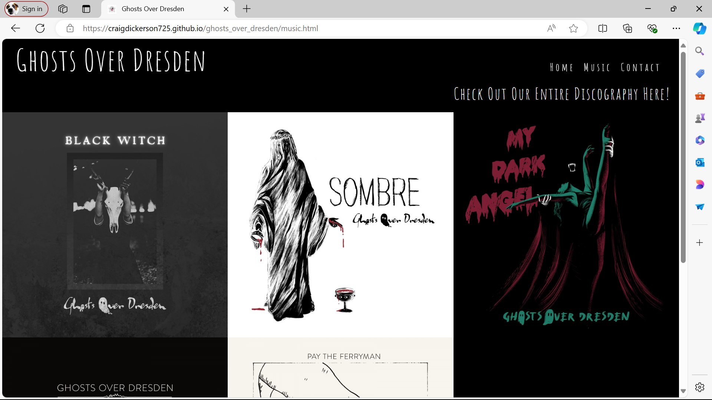
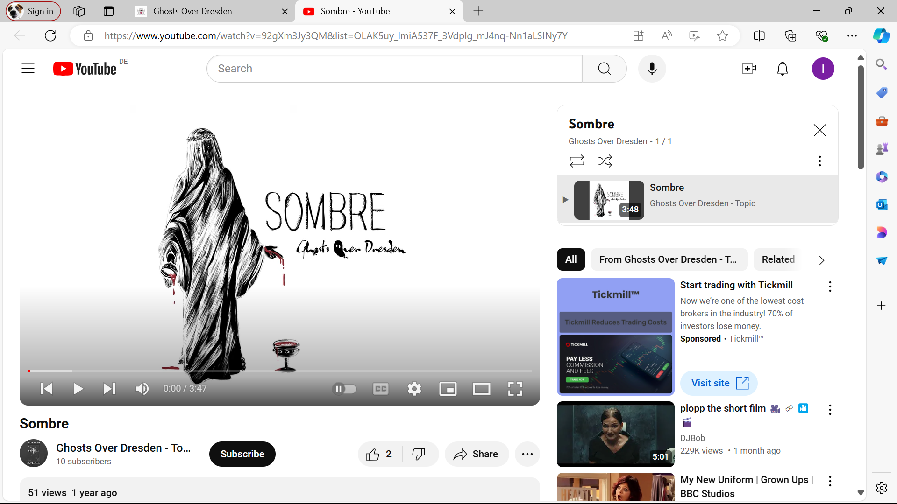
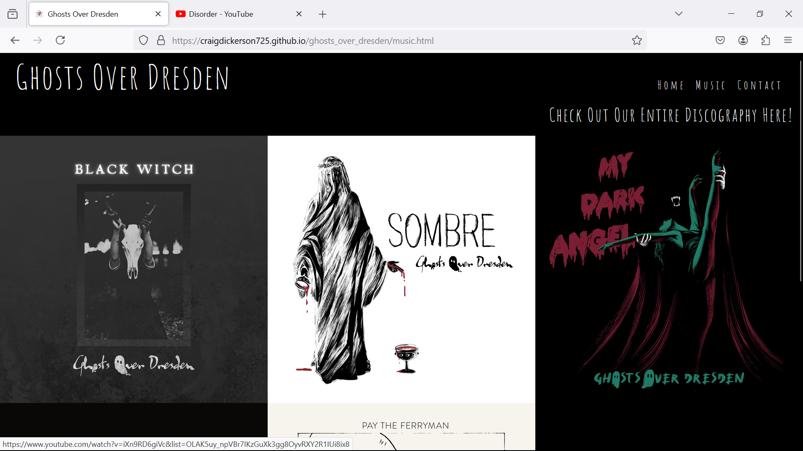
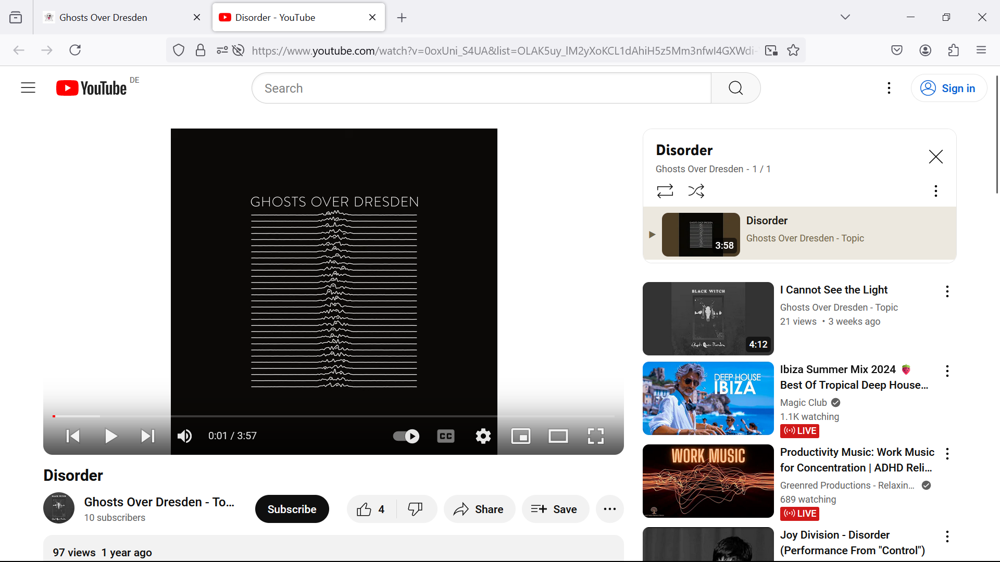

### Contact Form

The Contact Form on the Contact page has been tested across Chrome, Edge, and Firefox.  Each field is required, and attempting to submit incomplete fields provides the appropriate message to indicate to the user that the field must be properly filled out before the Submit function transmits the information.  A message is also sent to notify the user when the information has been successfully submitted.

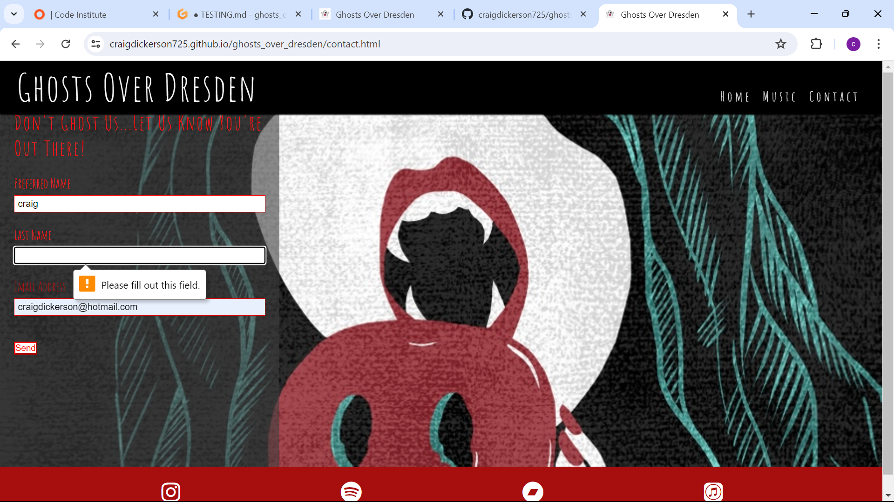
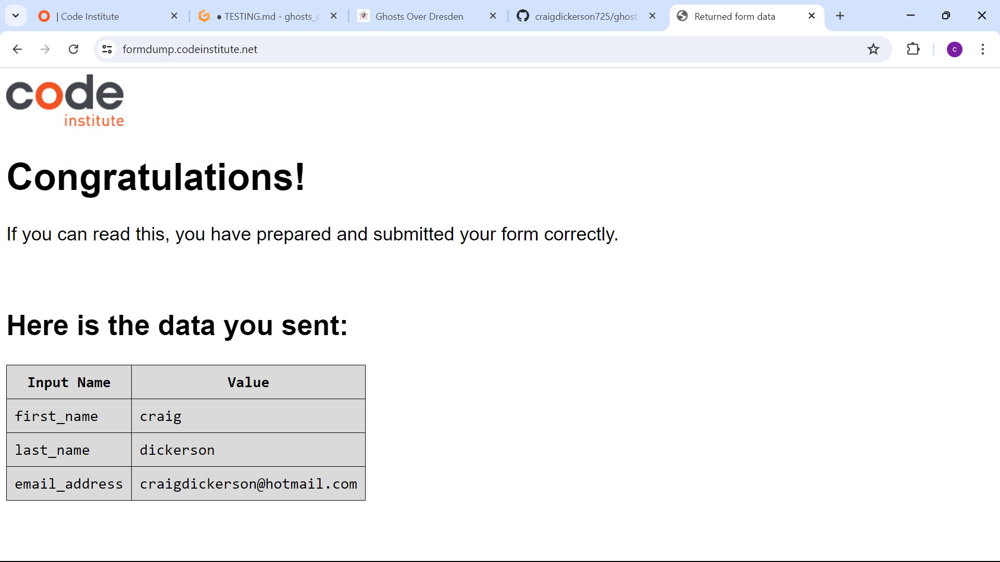
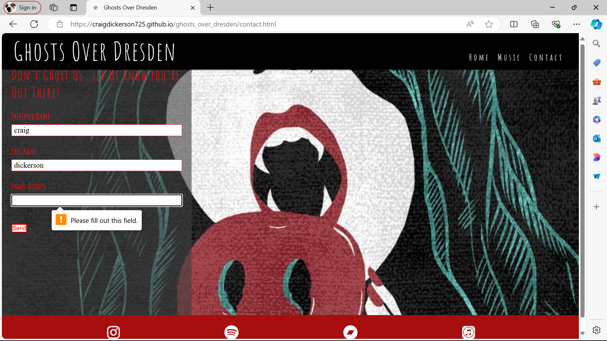
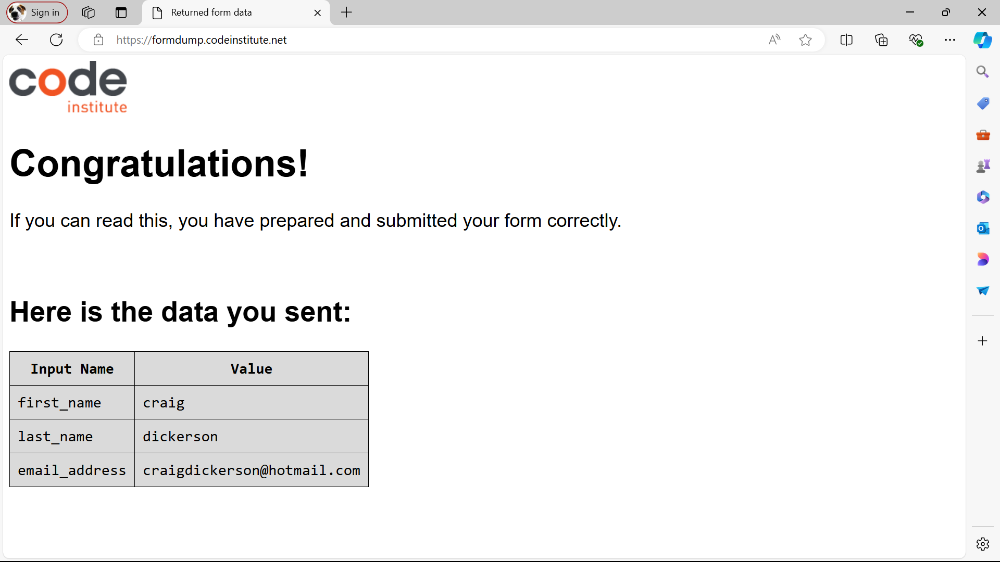
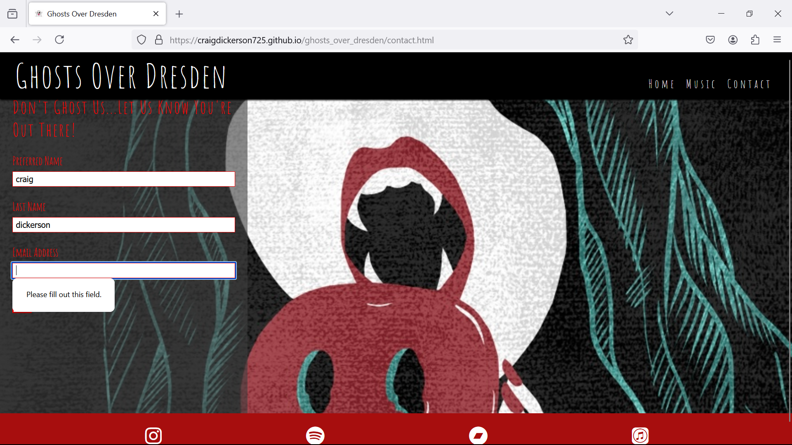
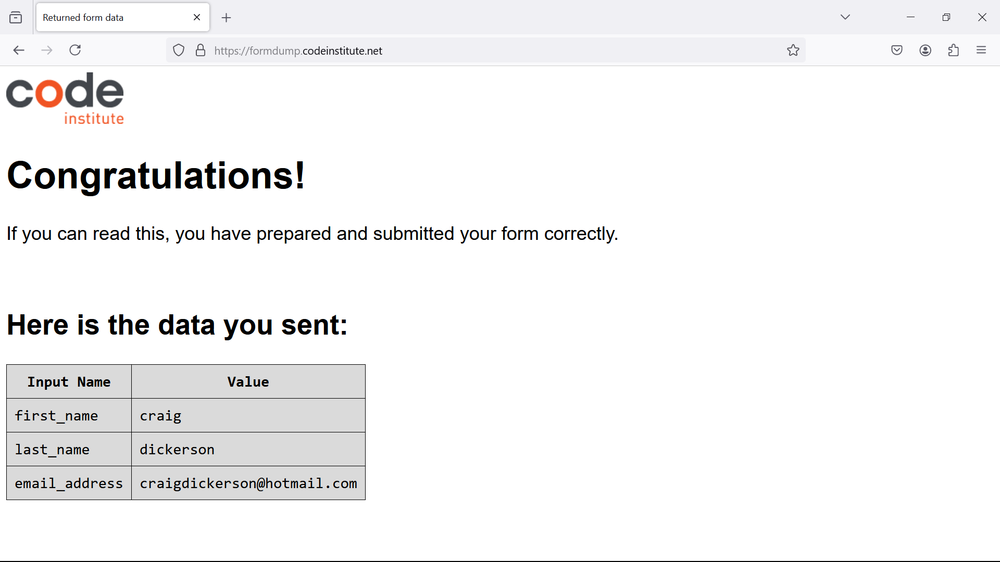