# Testing

> [!NOTE]  
> Return back to the [README.md](README.md) file.

## Feature-by-Feature Testing:

### Navigation 

The Navbar was the first feature tested. In the mobile design, it was important that it did not take up to much space, but rather just the right hand corner of the screen next to the header.  It is represented by a candelabra, which when touched opens a dropdown menu that provides quick and easy access to each page.

On large screens, the navbar is fully displayed with the names of each page.  The page names are responsive, and toggle to show which page is highlighted by the cursor.

The navbar is responsive and working as expected (with quick transitions between pages and links properly directed to the target page.  This was tested in Chrome, Edge, and Firefox.

### Footer

The footer is designed simply to provide quick access to the most desired social media and streaming platform pages for the band.  The icons all link to the proper pages, and do so in Chrome, Edge, and Firefox.

### Music

The Music page allows the user to see the complete discography for the band.  Each release is represented by its corresponding artwork.  Clicking the artwork directs the user to the YouTube page for listening.  Each link works correctly and is properly labeled, and the images are all properly marked with alt text for screenreaders.  This has been tested in Chrome, Edge, and Firefox.

### Contact Form

The Contact Form on the Contact page has been tested across Chrome, Edge, and Firefox.  Each field is required, and attempting to submit incomplete fields provides the appropriate message to indicate to the user that the field must be properly filled out before the Submit function transmits the information.  A message is also sent to notify the user when the information has been successfully submitted.

## User Experience Testing:

- Usability Testing: The band members themselves tested the site across their mobile devices and desktop/laptops for functionality.  Feedback regarding feature performance was all positive, as all features seem to work without error (as demonstrated above).  However, late in the development stages, they requested that the image used for the bio section to be removed, as it was a photo, and seemed to break away from the rest of the color scheme of the all original artwork.  It was decided that the Bio text would simply be under the hero image to make the homepage look neater, and more in line with the rest of the artwork on the other pages.

## Compatibility Testing:

- Browser Compatibility: Testing on Chrome, Edge, and Firefox has been demonstrated in the screenshots for each tested section above.

- Device Compatibility: Aside from our laptop testing (demonstrated in the screenshots in the previous sections), we also tested the site on our iPhones.

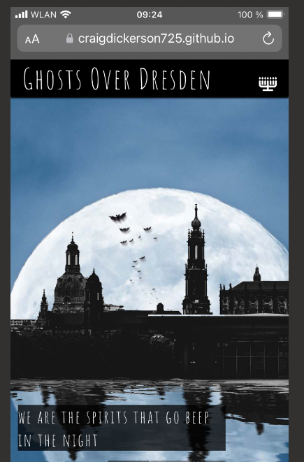
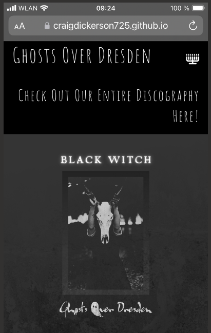

- Regression Testing:  As this site was built step by step, each section that was added did not interfere (in any way noticeable to us) with any previous section's functionality.  

- Documentation and Logs:  So far, throughout the testing of the site, the only issues came from sizing styles.  As far as features and their functions, there have not been any bugs detected.

## Code Validation

### HTML

I have used the recommended [HTML W3C Validator](https://validator.w3.org) to validate all of my HTML files.

| Directory | File | Screenshot | Notes |
| --- | --- | --- | --- |
|  | contact.html |  | |
|  | index.html |  | |
|  | music.html |  | |

### CSS

I have used the recommended [CSS Jigsaw Validator](https://jigsaw.w3.org/css-validator) to validate all of my CSS files.

| Directory | File | Screenshot | Notes |
| --- | --- | --- | --- |
| assets | style.css |  | |

## Browser Compatibility

I've tested my deployed project on multiple browsers to check for compatibility issues.

| Browser | Home | About | Contact | etc | Notes |
| --- | --- | --- | --- | --- | --- |
| Chrome |  |  |  | Works as expected |
| Firefox |  |  |  | Works as expected |
| Edge |  |  |  | Works as expected |

## Responsiveness

I've tested my deployed project on multiple devices to check for responsiveness issues.

| Device | Home | About | Contact | etc | Notes |
| --- | --- | --- | --- | --- | --- |
| Mobile (DevTools) |  |  |  | Works as expected |
| Tablet (DevTools) |  |  |  | Works as expected |
| Laptop (DevTools |  |  |  | Works as expected |
| 4K Monitor (DevTools)|  |  |  | Noticeable scaling issues |
| iPhone 14 (DevTools|  |  |  | Works as expected |

## Lighthouse Audit

I've tested my deployed project using the Lighthouse Audit tool to check for any major issues.

| Page | Mobile | Desktop | Notes |
| --- | --- | --- | --- |
| Home | 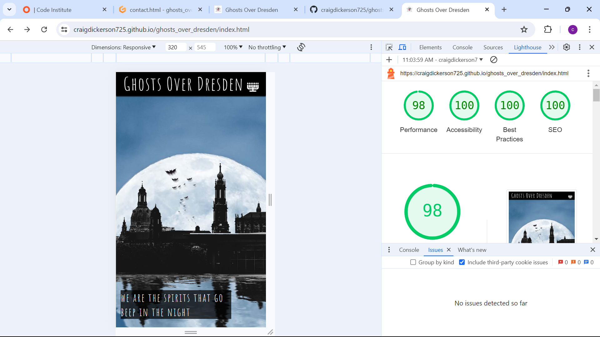 | 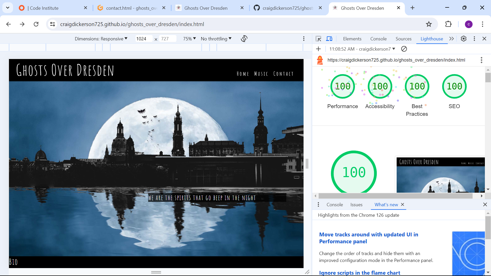 | Some minor warnings |
| Music |  | 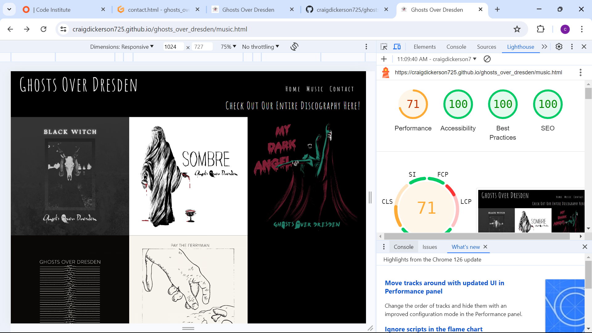 | Some minor warnings |
| Contact | 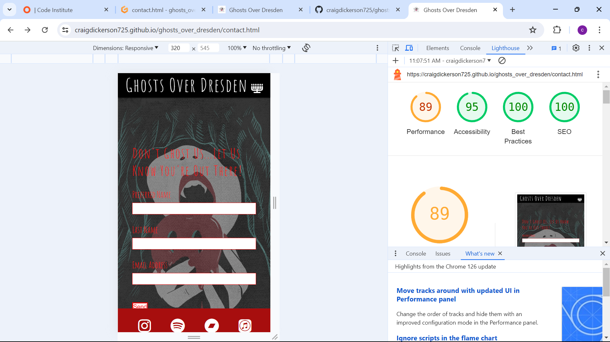 | 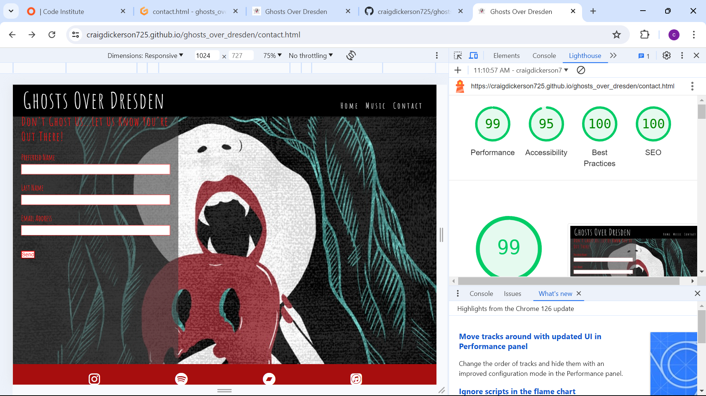 | Some minor warnings |

## User Story Testing

| User Story | Screenshot |
| --- | --- |
| As a new site user, I would like to see a cool, catchy graphic, so that I can get a feel for the vibe of the band. | 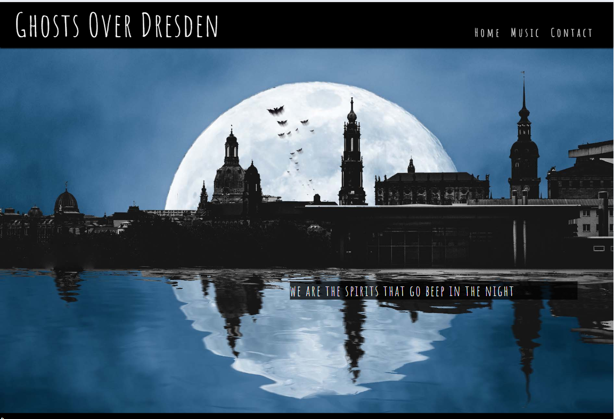 |
| As a new site user, I would like to have a discography page that links to the band's releases, so that I can hear the music they are making. | 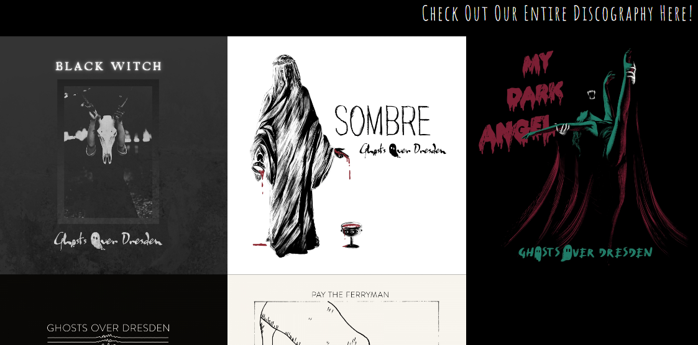 |
| As a new site user, I would like to have a contact page, so that I can connect with the band and receive news concerning the band as it happens. | 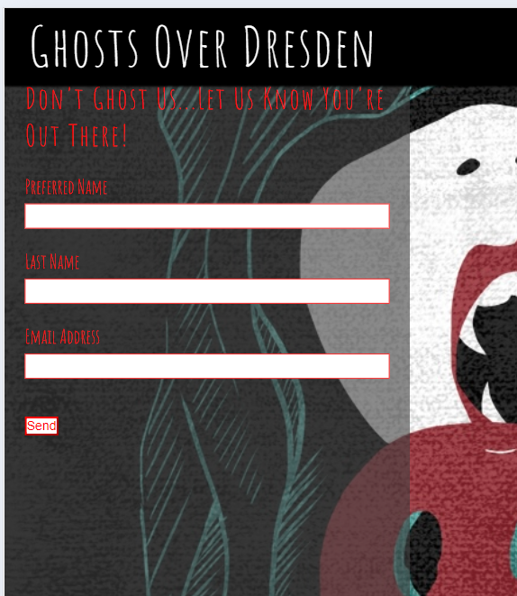 |
| As a returning site user, I would like to easily find the complete discography, so that I can listen to the music that I have not yet heard. |  |
| As a returning site user, I would like to easily find a way to contact the band, so that I can request live shows, merch, or anything that I feel should be made available to fans. |  |
| As a returning site user, I would like to have quick access to the various social media pages for the band, as well as streaming platforms, so that I can see what the band is up to more immediately (ie, daily social posts, etc). | 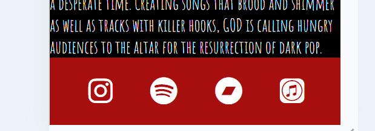 |

## Bugs

As far as functionality of the features is concerned, we have found that everything works as expected.  This includes the interactive header and footer, as well as the links to the album art and the interactive contact form.  

However, there were warnings from the Lighthouse audits that show that the performance of the music page would be better if the layout shifts were improved.  The sizing of the images was a bit tricky, considering their size, and the odd number of them made it difficult to line them up any other way, therefore it remains unchanged.  As new releases come in the future, this will be improved.

Also worth noting is a scaling issue when using a 4k monitor.  We did not have access to a 4k monitor, so we tested it using DevTools.  The first time we did this in DevTools, there was a rather large space on the bottom of the screen.  We did not photo it, as we assumed it would happen again and we would be able to screenshot it if it remained consistent.  However, as we ran the 4k view in DevTools afterward, it displayed as it should (which is documented in the responsiveness section screenshot).

## Unfixed Bugs

> [!NOTE]  
> There are no remaining bugs that I am aware of.